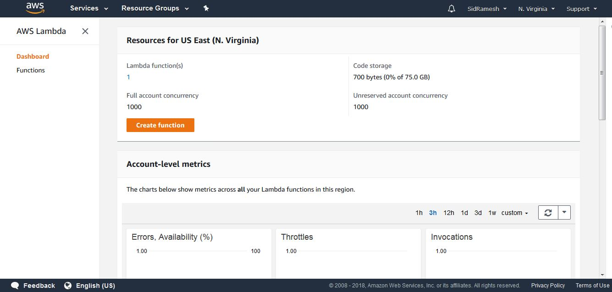

# Intro to AWS Lambda

NoVaLUG Meetup 8th-Sept-2018

Sid Ramesh - Data Analyst

Karsun Solutions

[@sidhu177](https://twitter.com/sidhu177?lang=en) 

[github.com/sidhu177](https://github.com/sidhu177)

---

## Goals of this Talk
 - Get to Know Lambda
 - Go through the Console
 - Know the limitations
 - Look at some examples
 - Resources

---

### Intro to AWS Lambda
In this talk we will be going through feature and functions of AWS Lambda. We will be looking at how to get started , the use cases and some examples using Python 3.5 programming language.

---

### Lambda 101
AWS Lambda is an event driven purely compute resource that allows users to deploy code directly and not worry about infrastructure maintenance. Think of it as pushing just the python script as opposed to instantiating the EC2 and updating the OS, maintaining security patches, installing the language with dependant libraries and then running your code. Lambda does away with all of that. Just Fire and Forget.

+++

### Departure from Previous Architectures

With on demand serverless compute, Lambda is replacing EC2s in traditional architectures and is demonstrating performance all the while reducing cost.

+++

### Cost Benefit
 - Billed in milli seconds 
 - steps in 100 milli seconds
 - On demand run and scale as you go
needless to say, lambda offers some impressive cost benefits that makes it hard to ignore
---

### Dashboard 
In this talk we will be using the Dahsboard to launch the Lambda function


+++ 

To launch a lambda function you have 3 options 
* start from scratch
* use a readymade blueprint
* use a repo that AWS offers

+++ 

Lets choose start from scratch for a quick example

you will need to 
 - name your function
 - choose the language 
 - choose a role

+++

Next is the Lambda console. Notice that you have an embedded code editor. 

Thats the cloud9 integration right in your browser that allows you to edit code and run realtime. 

*fun fact: its powered by linux*

---

### Go Run
When running lambda you will need the name of the python file and the name of the function that you want to call defined in the console. 

The main function with Lambda in python looks like this
```
def handler(event,context):
    return "What's Up!"
```

Here *handler* is the name of the function, event and context are the default parameters that have to be passed to the function with return being the output

+++

*event* is usually used to pass in triggers from other services and has a JSON format

*context* is used to get the remaining time information

+++

By default, Lambda is going to log any function you run. You can customize the log if you need more details.

Logging and Exceptions are handled through cloud watch logs. You will see the exception used for the failure displayed on the console and on the log

+++

You can use environment variables to pass mannual data to your function

```
import json
import os

# val =  os.environ['Key1']

def lambda_handler(event,context):
    
    print('message to be printed '+ event['message'])
    # print(val)
    return event['message']
```
+++

Now lets look at the console, we have
 - the return value
 - the printed message
 - the duration it took to run
 - And max memory used

+++

Now for an example on using the lambda console and the levers that we can use to make changes to lambda runtime. Below is an example on compute times.

```
def lambda_handler(event,context):
    calc = 2**3**2
    print(calc)
    print("Remaining Time in MilliSeconds: " + str(context.get_remaining_time_in_millis()))
    print("This is the RequestID: " + str(context.aws_request_id))
    return "End of Lambda Function"
```
+++

Notice how the remaining time changes per each calculation, if the scope of your program requires more memory and running time to execute, you can do that in the *Basic Settings*

+++
### Dependant functions

AWS does not provide all the libraries for the python language and if you have a specific and uncommon library that you use to call your function, chances are the import function in lambda will fail. 

When using a depandant library in your code, you can upload a package that your function will call during execution and Lambda will have the libraries installed and ready 

+++
### Versioning and Aliasing

Another important tools in using Lambda are being able to Version your code and have Alias to your function. 
 - $LATEST is the version that is mutable and will exist by default
 - publishing a version creates an immutable numbered version
 - Alias can be used to concurrent functions which can be used for splitting traffic
 - With versioning, development is easier and if need be you can rollback to a previous workable code

---

### Event Trigger
One of the many advantages of Lambda is ease of wiring it with others services like

 - API requests
 - Cloudwatch events
 - S3 
 - other event triggers

So we are essentially putting lego pieces together

+++

### Configuring Triggers
Configuring Triggers essentially consist of explicitly specifying a rule which has permissions if required to read data from other services

+++

### Different Call Types
 - Asynchronous : Anytime you fire a function without an order and do not return an output
 - Synchronous : When order of recieving the request and returning an output matter
 - Push : Services connected to Lambda have the permission to input to Lambda
 - Pull : Lambda has the permission to ask for data from other services like S3, cloudwatch

+++

### Event Source Mapping
Adding a trigger from the given list to your lambda function is in AWS Lingo "Event Source Mapping"

+++
### Blueprints

Perviously we looked at the author from scratch way for creating lambda. AWS also provides wide array of Blueprints that come with batteries included. You can use blueprints to do just about most of the functions. 

+++
### S3 to SNS Example
Lets try putting what we went through into action. In this example we'll 
 - create an S3 bucket and configure that with Lambda function. 
 - Then we will upload an object to the bucket and use the monitoring tab to look at the result. 
 - And then we will configure it with an SNS topic that will send a text message conveying the result.

+++

```
import json
import boto3
import os

print("starting invocation")

def lambda_handler(event, context):

    bucket = event['Records'][0]['s3']['bucket']['name']
    print(bucket)
    sns.publish(
        Message=('New object has been uploaded to your S3: '+ str(bucket)), 
        PhoneNumber='+123456789'
)
```
+++
Test JSON

```
{
  "Records": [
      "s3": {
        "configurationId": "testConfigRule",
        "object": {
          "eTag": "0123456789abcdef0123456789abcdef",
          "sequencer": "0A1B2C3D4E5F678901",
          "key": "HappyFace.jpg",
          "size": 1024
        },
        "bucket": {
          "arn": "arn:aws:s3:::mybucket",
          "name": "sourcebucket",
          "ownerIdentity": {
            "principalId": "EXAMPLE"
          }
        },
  ]
}
```
+++

### Lambda for Deployment

Lambda can also be used to deploy, with the right roles and permissions, you can use lambda to deploy EC2s and other AWS resources.

```
def lambda_handler(event, context):
    instance = EC2.run_instances(
        ImageId=AMI,
        InstanceType=INSTANCE_TYPE,
        MinCount=1, # required by boto, even though it's kinda obvious.
        MaxCount=1,
        InstanceInitiatedShutdownBehavior='terminate', # make shutdown in script terminate ec2
    )
```
---

### Limitations
 - Its important to note that AWS Lambda is not for managing underlying resources.
 - Retries happen when functions fail. Functions fail if it maxes out on provided time or if the input is wrong or unparseble and other contraints
 - scope of the functions should be self contained and stateless

+++

### Things to Keep Note
- *Cold Start* This is the phenomenon of the function taking a longer time when it initializes for the first run. Successive runs take much shorter time. Cold start times are different for various programming languages
- Max memory: 3000MB
- Max Time: 300 Seconds
- Max Default Concurrency: 1000
- Functions should be stateless and scope-limited

---
### Serverless Application Model

The SAM example goes here

---

### Use Cases
Lambda has found real world use cases in a lot of places. some known examples are:
- One example of using Lambda is in ETL.
- its used as infrastructure as code 
- its also used for standalone application

---

### Resources
1) [AWS Lambda](https://docs.aws.amazon.com/lambda/latest/dg/welcome.html)
2) [linuxacademy - Certified Dev 2018](https://linuxacademy.com/)
3) [Lynda - Learning AWS Lambda](https://www.lynda.com/)
4) [Safari - Building Serverless Applications with Python](https://www.packtpub.com/application-development/building-serverless-applications-python)
5) [nice web resource](https://wilsonmar.github.io/aws-lambda/)
6) [lambda cheat sheet](https://github.com/srcecde/aws-lambda-cheatsheet)
7) [EC2 Deploy using Lambda](https://medium.com/tomincode/launching-ec2-instances-from-lambda-4a96f1264afb)